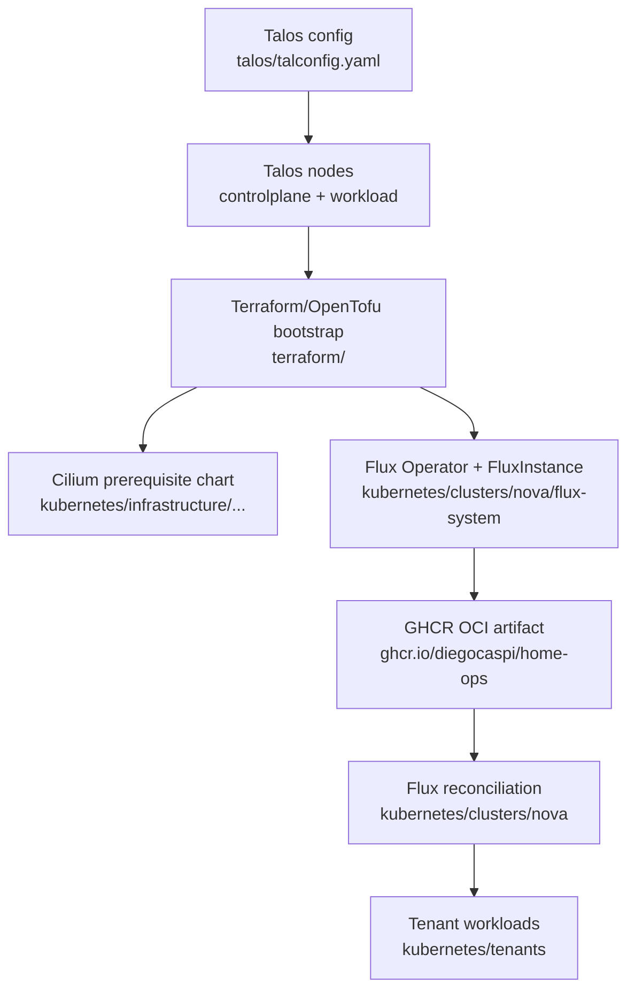

# home-ops

Declarative homelab operations for the `nova` Kubernetes cluster.

[](https://www.talos.dev/)
[](https://kubernetes.io/)
[](https://fluxcd.io/)
[](https://opentofu.org/)

## Overview

This repository manages a Talos-based Kubernetes cluster with a small set of explicit layers:

1. `talos/` defines the machine and Kubernetes control-plane configuration.
2. `terraform/` performs the one-time cluster bootstrap that installs Cilium and Flux Operator resources.
3. `kubernetes/` contains the GitOps payload reconciled by Flux from a signed GHCR OCI artifact.
4. `.github/workflows/push-artifact.yaml` packages `kubernetes/` and publishes it to GHCR when Kubernetes manifests change.

The current structure no longer uses the old `infrastructure/` and `bootstrap/` directories. Bootstrap now happens through the Terraform/OpenTofu module in `terraform/`, and Flux syncs from `oci://ghcr.io/diegocaspi/home-ops`.


```mermaid
graph TB
    A["Talos config<br/>talos/talconfig.yaml"]
    B["Talos nodes<br/>controlplane + workload"]
    C["Terraform/OpenTofu bootstrap<br/>terraform/"]
    D["Cilium prerequisite chart<br/>kubernetes/infrastructure/..."]
    E["Flux Operator + FluxInstance<br/>kubernetes/clusters/nova/flux-system"]
    F["GHCR OCI artifact<br/>ghcr.io/diegocaspi/home-ops"]
    G["Flux reconciliation<br/>kubernetes/clusters/nova"]
    H["Tenant workloads<br/>kubernetes/tenants"]

    A --> B --> C
    C --> D
    C --> E
    E --> F
    F --> G
    G --> H
```

## Current Cluster

`nova` is defined in `talos/talconfig.yaml`:

- Talos Linux: `v1.13.3`
- Kubernetes: `v1.36.0`
- Endpoint: `https://192.168.2.144:6443`
- Nodes:
  - `controlplane`, control-plane node, `192.168.2.144`
  - `workload`, worker node, `192.168.2.19`
- Region/runtime label: `tpi`
- Control-plane scheduling: enabled
- Talos system extension: `siderolabs/rockchip-rknn`

## Repository Structure

```text
.
├── .github/workflows/
│   └── push-artifact.yaml          # Publishes the Kubernetes tree as a signed GHCR OCI artifact
├── docs/
│   ├── cluster/                    # Cluster bootstrap notes
│   └── infrastructure/             # Infrastructure setup notes
├── hack/
│   ├── homelab-bgp.conf            # BGP reference/config helper
│   └── validate.sh                 # Repository validation helper
├── kubernetes/
│   ├── apps/                       # Reserved for application workloads
│   ├── clusters/nova/              # Flux entrypoint for the nova cluster
│   │   ├── flux-system/            # Flux Operator, FluxInstance, runtime info
│   │   ├── kustomization.yaml
│   │   └── tenants.yaml            # Reconciles ./tenants through Flux
│   ├── infrastructure/kube-system/ # Cilium controller/config manifests and values
│   └── tenants/                    # Tenant-level Flux resources
├── talos/
│   ├── apply.sh                    # Applies generated Talos configs to nodes
│   ├── clusterconfig/              # Generated Talos configs and kubeconfig output
│   ├── mod.just                    # Talos just recipes
│   ├── talconfig.yaml              # Cluster topology and versions
│   └── talsecret.sops.yaml         # SOPS-encrypted Talos secrets
├── terraform/
│   ├── main.tf                     # Flux Operator bootstrap module
│   ├── mod.just                    # Bootstrap just recipes
│   ├── providers.tf                # Kubernetes and Helm providers
│   └── variables.tf                # Bootstrap variables
├── justfile                        # Imports the talos and terraform just modules
├── .mise.toml                      # Local tool/runtime configuration
├── .sops.yaml                      # SOPS encryption rules
└── README.md
```

## Talos Operations

The root `justfile` imports the Talos module, so Talos workflows are available from the repository root.

```bash
just talos gen
just talos encrypt
just talos apply
just talos kubeconfig
```

What these recipes do:

- `just talos gen` generates machine configs from `talos/talconfig.yaml` and `talos/talsecret.sops.yaml`.
- `just talos encrypt` encrypts `talos/talsecret.sops.yaml` using `.sops.yaml`.
- `just talos apply` applies the generated configs to every node listed in `talos/talconfig.yaml`.
- `just talos kubeconfig` writes a kubeconfig to `talos/clusterconfig/kubeconfig`.

## Cluster Bootstrap

Bootstrap is handled from `terraform/` through the Flux Operator bootstrap module.

```bash
OCI_TOKEN=... just terraform bootstrap-nova
```

The recipe:

- Chooses `tofu` when available, otherwise falls back to `terraform`.
- Sets `TF_VAR_oci_token`, `TF_VAR_cluster_name=nova`, and `TF_VAR_cluster_region=tpi`.
- Runs `init` and `apply` in `terraform/`.

The Terraform module installs the Flux Operator bootstrap resources and uses repository-local manifests for:

- The Flux instance: `kubernetes/clusters/nova/flux-system/flux-instance.yaml`
- Flux Operator values: `kubernetes/clusters/nova/flux-system/flux-operator-values.yaml`
- Cilium bootstrap values: `kubernetes/infrastructure/kube-system/controllers/nova/cilium.values.yaml`
- Runtime information such as `CLUSTER_REGION`
- A `ghcr-auth` pull secret for the Flux OCI source

The Kubernetes and Helm providers currently use:

```text
~/.kube/clusters/nova.yaml
```

## GitOps Flow

Flux is configured as a `FluxInstance` in `kubernetes/clusters/nova/flux-system/flux-instance.yaml`.

It syncs:

- Source kind: `OCIRepository`
- Artifact: `oci://ghcr.io/diegocaspi/home-ops`
- Ref: `latest`
- Path inside artifact: `clusters/nova`
- Pull secret: `ghcr-auth`

The GitHub workflow at `.github/workflows/push-artifact.yaml` publishes the `kubernetes/` directory to GHCR on pushes to `main` that touch Kubernetes manifests or the workflow itself. The artifact is signed with cosign, and the Flux OCI source is patched to verify signatures from the GitHub Actions OIDC identity for this repository.

Inside the cluster entrypoint, `kubernetes/clusters/nova/tenants.yaml` tells Flux to reconcile `./tenants`, which currently contains the infrastructure tenant definition.

## Secrets

Secrets are expected to stay encrypted or local:

- `talos/talsecret.sops.yaml` is encrypted with SOPS.
- `.env` is ignored by Git and can hold local tokens such as `OCI_TOKEN`.
- Terraform receives the GHCR token through `TF_VAR_oci_token`, set by the `just terraform bootstrap-nova` recipe.

## Useful Commands

```bash
just --list
just talos gen
just talos apply
just talos kubeconfig
OCI_TOKEN=... just terraform bootstrap-nova
```

## Further Reading

- [Cluster bootstrap notes](docs/cluster/bootstrap.md)
- [Proxmox/OpenTofu notes](docs/infrastructure/proxmox-opentofu.md)
- [Infrastructure automation notes](docs/infrastructure/automation.md)
