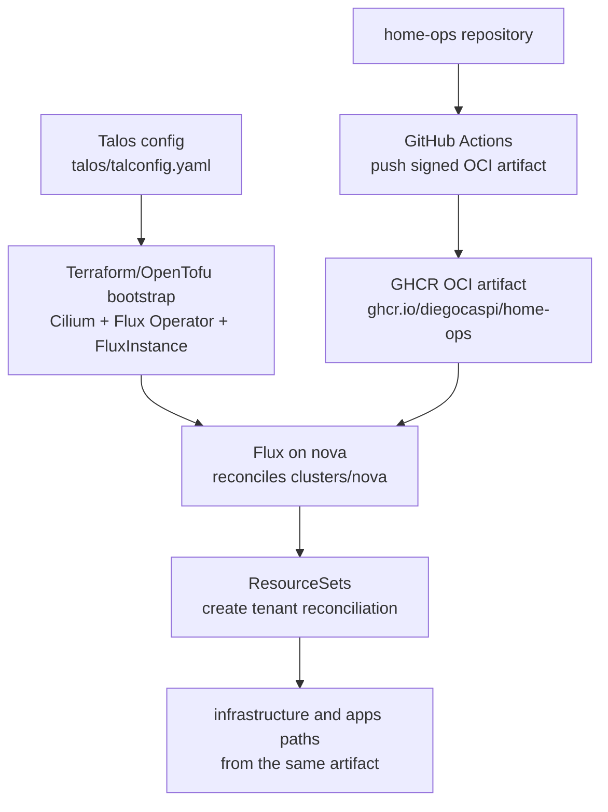

# home-ops

`home-ops` is a production-style operations repository for the `nova` homelab Kubernetes cluster.

The repository manages Talos node configuration, cluster bootstrap, GitOps reconciliation, secret integration, lifecycle maintenance, and operational documentation for `nova`.

## Architecture

`home-ops` uses a monorepo adaptation of the Flux D2 reference architecture. Desired state is tracked in Git, packaged by GitHub Actions as a signed OCI artifact in GHCR, and reconciled by Flux from that artifact instead of directly from Git.

```mermaid
graph TB
    repo["home-ops repository"]
    actions["GitHub Actions\npush signed OCI artifact"]
    artifact["GHCR OCI artifact\nghcr.io/diegocaspi/home-ops"]
    talos["Talos config\ntalos/talconfig.yaml"]
    bootstrap["Terraform/OpenTofu bootstrap\nCilium + Flux Operator + FluxInstance"]
    flux["Flux on nova\nreconciles clusters/nova"]
    tenants["ResourceSets\ncreate tenant reconciliation"]
    payload["infrastructure and apps paths\nfrom the same artifact"]

    repo --> actions --> artifact
    talos --> bootstrap
    bootstrap --> flux
    artifact --> flux --> tenants --> payload
```

See `docs/architecture.md` for the D2 mapping and how the repository layers fit together.

## Repository Map

`talos/` defines the `nova` node topology, generated Talos configs, and Talos operation recipes.

`terraform/` contains the OpenTofu/Terraform bootstrap module that installs Flux Operator resources, Cilium prerequisites, runtime information, and initial secrets.

`kubernetes/` is the GitOps payload published to GHCR. The active cluster entrypoint is `kubernetes/clusters/nova/`, tenant wiring lives in `kubernetes/tenants/`, platform services live in `kubernetes/infrastructure/`, and application workloads live in `kubernetes/apps/`.

`kubernetes/clusters/update/` supports lifecycle maintenance automation. It is not an operated homelab cluster.

`docs/` contains operator-focused documentation. `CONTEXT.md` defines the project language used across the repo.

## Quick Start

Install the toolchain with `mise install`. The pinned tools live in `.mise.toml`.

Use `just --list` to see available recipes.

Common entrypoints:

- `hack/validate.sh -d kubernetes`
- `just talos gen`
- `just talos apply`
- `just talos kubeconfig`
- `OCI_TOKEN=... ONEPASSWORD_TOKEN=... just terraform bootstrap-nova`

## Documentation

- `CONTEXT.md`: glossary for project-specific language.
- `docs/architecture.md`: architecture, Flux D2 mapping, and repository layers.
- `docs/bootstrap.md`: bootstrap model, prerequisites, command, and expected outcome.
- `docs/operations.md`: routine operator workflows and validation expectations.
- `docs/gitops.md`: OCI artifact publishing, Flux reconciliation, tenants, and lifecycle maintenance.
- `docs/secrets.md`: secret boundaries and the Kubernetes-side secret contract.
- `docs/recovery.md`: non-destructive recovery checks and escalation paths.
- `docs/reference.md`: current mutable facts with source files.
- `docs/adr/`: architecture decision records.

## References

- [Flux D2 Reference Architecture](https://github.com/controlplaneio-fluxcd/distribution/tree/main/docs)
- [Flux Operator](https://github.com/controlplaneio-fluxcd/flux-operator)
- [Flux OCIRepository](https://fluxcd.io/flux/components/source/ocirepositories/)
