# 🏠 home-ops

> A layered GitOps monorepo for managing homelab infrastructure, from bare metal to Kubernetes workloads

[](https://www.talos.dev/)
[](https://kubernetes.io/)
[](https://fluxcd.io/)
[](https://opentofu.org/)

---

## 📖 Overview

This repository represents a complete infrastructure-as-code implementation of a homelab Kubernetes cluster, built on the foundation of Proxmox VE virtualization and Talos Linux. What makes this approach interesting is its layered architecture—each layer builds deliberately on top of the previous one, creating a stack where infrastructure, operating system, and application layers are all defined declaratively in code.

The entire system flows from bare metal to running workloads through four distinct layers: infrastructure provisioning, OS configuration, initial bootstrapping, and continuous GitOps reconciliation. Each layer has its own lifecycle and purpose, but they work together to create a fully automated, reproducible infrastructure.

```mermaid
%%{init:
{
  "theme": "default",
  "themeVariables": {
    "nodeBorder" : "#004990",
    "mainBkg" : "#c9d7e4",
    "actorBkg" : "#01A6F0",
    "signalColor" : "#F34F1C",
    "textColor" : "#000000",
    "loopTextColor" : "#C7C7C7",
    "labelTextColor" : "#C7C7C7",
    "labelBoxBorderColor" : "#7FBC00",
    "labelBoxBkgColor" : "#7FBC00",
    "noteBkgColor" : "#FFBA01",
    "noteBorderColor": "#FFBA01",
    "fontFamily": "Inter",
    "fontSize": "13px"
 }
}
}%%
graph TB
    A["🏗️ Infrastructure Layer<br/>(VM Provisioning)<br/><br/>Terragrunt + OpenTofu<br/>manage Proxmox VMs"]
    B["🐧 Talos Layer<br/>(OS Configuration)<br/><br/>Talos Linux installation<br/>and cluster configuration"]
    C["🚀 Bootstrap Layer<br/>(One-time Setup)<br/><br/>Helmfile installs Cilium<br/>+ Flux to enable GitOps"]
    D["🔄 Kubernetes Layer<br/>(GitOps - Automatic Reconciliation)<br/><br/>Flux continuously syncs<br/>cluster state from Git"]

    A --> B --> C --> D

    style A fill:#f9f,stroke:#333,stroke-width:2px
    style B fill:#bbf,stroke:#333,stroke-width:2px
    style C fill:#bfb,stroke:#333,stroke-width:2px
    style D fill:#fbb,stroke:#333,stroke-width:2px
```



## 🏗️ The Layered Architecture

### Layer 1️⃣: Infrastructure (`infrastructure/`)

The foundation of everything starts with virtual machine provisioning. Rather than manually creating VMs through the Proxmox web interface, this layer uses OpenTofu (an open-source Terraform fork) managed by Terragrunt to declaratively define the virtual infrastructure. The choice of Terragrunt over plain Terraform brings some valuable benefits—particularly around managing remote state in Cloudflare R2 and keeping configurations DRY across multiple Proxmox hosts.

The structure here is intentionally modular. There's a shared Proxmox module at `infrastructure/shared/proxmox/` that contains the actual VM resource definitions—things like downloading the Talos Linux ISO, creating VMs with specific CPU and memory configurations, and setting up disks and networking. Each physical Proxmox host (like "hypnos") gets its own directory under `infrastructure/hosts/` with a `terragrunt.hcl` file that specifies exactly which VMs should exist on that particular host.

What's particularly nice about this approach is that the entire VM configuration is versioned in Git. Want to add another worker node? Just update the `terragrunt.hcl` file with the new node specification, run `infra-apply`, and the VM materializes. The state is stored remotely in Cloudflare R2, which means multiple people (or CI/CD systems) could theoretically manage the same infrastructure without stepping on each other's toes.

### Layer 2️⃣: Talos (`talos/`)

Once the VMs exist, they need an operating system—but not just any OS. Talos Linux is an interesting choice for Kubernetes infrastructure because it's designed from the ground up to run Kubernetes and nothing else. There's no SSH access, no package manager, no traditional Linux distribution baggage. Everything is configured through an API, and the entire OS is immutable.

The Talos layer centers around `talconfig.yaml`, which defines the entire cluster topology—how many nodes, their IP addresses, which ones are control plane vs workers, what version of Talos and Kubernetes to run. The tool `talhelper` takes this high-level configuration and generates the actual machine configs for each node, outputting them to `talos/clusterconfig/`. These configs include sensitive data like certificates and tokens, which is why `talsecret.sops.yaml` exists—it's encrypted using SOPS with age encryption, ensuring secrets never hit Git in plaintext.

The beauty of this approach is reproducibility. The entire cluster configuration is captured in a single YAML file. If you needed to rebuild the cluster from scratch or add new nodes, you'd regenerate the configs with `talos-gen` and apply them with `talos-apply`. The `apply.sh` script orchestrates this by reading the `talconfig.yaml`, finding each node's config file, and applying it to the appropriate IP address.

### Layer 3️⃣: Bootstrap (`bootstrap/`)

Here's where things get interesting. At this point, we have VMs running Talos Linux, and Talos has formed a Kubernetes cluster. But it's a bare cluster—no CNI (Container Network Interface), no DNS, no GitOps tooling. This is where the bootstrap layer comes in, but it's explicitly designed to be run **only once**.

The `bootstrap/helmfile.yaml` uses Helmfile to install the foundational components that enable everything else. First comes Cilium, which provides the CNI so that pods can actually communicate with each other. CoreDNS follows, giving the cluster internal DNS resolution. Then comes the Flux Operator and Flux Instance—these are what enable the GitOps workflow.

The reason this exists as a separate layer rather than being part of the Kubernetes layer is philosophical: these components need to exist before GitOps can take over, creating a bootstrapping chicken-and-egg problem. Helmfile provides a way to install these dependencies imperatively just once, after which Flux can manage everything else declaratively. It's a clean separation of concerns—bootstrap gets the cluster to a state where GitOps is possible, then steps aside.

### Layer 4️⃣: Kubernetes (`kubernetes/`)

Once the bootstrap layer has run and Flux is installed, this layer takes over completely—and it never stops working. Flux monitors this Git repository, watching the `kubernetes/` directory for changes. When it detects a commit, it automatically reconciles the cluster state to match what's in Git. This is the true GitOps workflow: Git becomes the single source of truth for everything running in the cluster.

The structure here follows an opinionated pattern. The `kubernetes/flux/` directory contains cluster-level Flux Kustomizations that define how Flux should reconcile resources. The `kubernetes/apps/` directory is organized by namespace, with each application getting its own subdirectory containing its manifests, whether those are raw Kubernetes YAML, Kustomizations, or HelmReleases. The `kubernetes/components/` directory holds reusable pieces that might be referenced by multiple applications.

What makes this powerful is the declarative nature. Want to deploy a new application? Create a directory under the appropriate namespace in `kubernetes/apps/`, add your manifests, commit, and push. Flux notices the change and deploys it automatically. Want to upgrade something? Update the version in the HelmRelease, commit, and Flux handles the rollout. The cluster continuously drifts toward the desired state defined in Git, and Flux handles all the complexity of applying changes in the right order with appropriate retry logic.

## 🔄 How It All Flows Together

The workflow through these layers is sequential by design. You start at the bottom with infrastructure—creating the VMs that will host the cluster. Once those exist, you move to the Talos layer, installing and configuring the operating system and forming the Kubernetes cluster. With a running cluster in hand, you run the bootstrap layer once to install the critical networking and GitOps components. Finally, the Kubernetes layer takes over, and from that point forward, everything is managed through Git commits that Flux automatically reconciles.

Each layer has its own lifecycle and deployment cadence. Infrastructure changes might happen when adding new physical hosts or resizing VMs. Talos updates occur when upgrading Kubernetes versions or modifying cluster configuration. Bootstrap only runs during initial cluster creation or disaster recovery. The Kubernetes layer, however, is continuously active—Flux is always watching, always reconciling.

This separation also provides clear boundaries for troubleshooting. Issues with VM provisioning are isolated to the infrastructure layer. Problems with cluster formation or node configuration live in the Talos layer. If GitOps isn't working, you're looking at the bootstrap or Kubernetes layers. Each layer has its own tools and commands, making it clear where to focus your attention.

## 🛠️ Development Environment

The repository uses Nix and devenv to provide a reproducible development environment. Rather than documenting "please install these 10 tools at these specific versions," you simply enter the devenv shell and everything is there: `talosctl`, `talhelper`, `opentofu`, `terragrunt`, `helmfile`, `kubectl`, `flux`, `sops`, and more. The `devenv.nix` file defines not just the packages but also custom scripts that wrap common operations.

Commands like `infra-plan`, `infra-apply`, `talos-gen`, `talos-encrypt`, `talos-apply`, and `boot` are all defined as devenv scripts. This creates a consistent interface across all layers—you don't need to remember the exact `talhelper` incantation to generate configs or the specific `sops` flags for encryption. The scripts handle those details, and the commands are self-documenting through their descriptions.

Environment variables are loaded automatically from `.env` via devenv's dotenv integration. This is where sensitive credentials live—Cloudflare R2 credentials for Terragrunt remote state, Proxmox API tokens for each host. The `infrastructure/root.hcl` Terragrunt configuration dynamically constructs environment variable names based on the host being managed, allowing multiple Proxmox servers to coexist with their own credentials.

## 📦 Technology Choices

Each technology in the stack was chosen for specific reasons. **OpenTofu** over Terraform because it's truly open-source and community-driven. **Terragrunt** because managing remote state and keeping configurations DRY across multiple modules is valuable. **Talos Linux** because immutable, API-configured infrastructure is the right way to run Kubernetes—no SSH, no configuration drift, no security vulnerabilities from unused system services.

**Cilium** for CNI because it's powerful, performant, and brings features like native load balancing and network policies based on eBPF. **FluxCD** for GitOps because it's declarative, extensible with Kustomize and Helm support, and battle-tested. **SOPS** with **age** for secrets because it encrypts only the values in YAML files, leaving the structure visible for Git diffs while keeping sensitive data secure.

The development environment uses **Nix** because reproducibility matters. Six months from now, entering the devenv shell will provide the exact same tool versions, ensuring commands don't break due to upstream changes.

## 🎯 Current Cluster: Nova

The cluster currently defined in this repository is named "nova" and runs:
- **Talos Linux v1.11.5** as the operating system
- **Kubernetes v1.34.0** for orchestration
- **Cilium v1.18.4** for networking
- Two nodes: a control plane at `192.168.2.58` that also runs workloads, and a dedicated worker at `192.168.2.202`

The control plane endpoint is `https://192.168.2.58:6443`, and both nodes are labeled with their physical location for potential scheduling decisions. Scheduling is allowed on the control plane node, which is common in smaller homelab deployments where you want to maximize resource utilization.

## 📁 Repository Structure

```
.
├── infrastructure/          # Layer 1: Proxmox VM provisioning
│   ├── root.hcl            # Terragrunt root config (remote state, variables)
│   ├── shared/proxmox/     # Shared Terraform module for VM resources
│   └── hosts/              # Per-host VM configurations
│
├── talos/                  # Layer 2: Talos OS configuration
│   ├── talconfig.yaml      # Cluster definition (nodes, IPs, versions)
│   ├── talsecret.sops.yaml # Encrypted cluster secrets
│   ├── clusterconfig/      # Generated Talos node configs
│   └── apply.sh            # Script to apply configs to all nodes
│
├── bootstrap/              # Layer 3: One-time bootstrap
│   └── helmfile.yaml       # Installs Cilium, CoreDNS, Flux
│
├── kubernetes/             # Layer 4: GitOps-managed resources
│   ├── flux/               # Flux cluster-level Kustomizations
│   ├── apps/               # Application manifests by namespace
│   └── components/         # Reusable Kubernetes components
│
├── docs/                   # Documentation
├── devenv.nix             # Nix development environment
├── devenv.yaml            # devenv configuration
├── .sops.yaml             # SOPS encryption rules
└── CLAUDE.md              # AI assistant context
```

## 📚 Further Reading

The `docs/` directory contains additional documentation on specific topics:
- **[Proxmox Setup](docs/infrastructure/proxmox-opentofu.md)** - How to configure Proxmox hosts for Terraform/OpenTofu access
- **[Cluster Bootstrap](docs/cluster/bootstrap.md)** - Details on the bootstrap process
- **[Infrastructure Automation](docs/infrastructure/automation.md)** - Information about infrastructure automation

---

**Built with** ❤️ **and lots of YAML**
